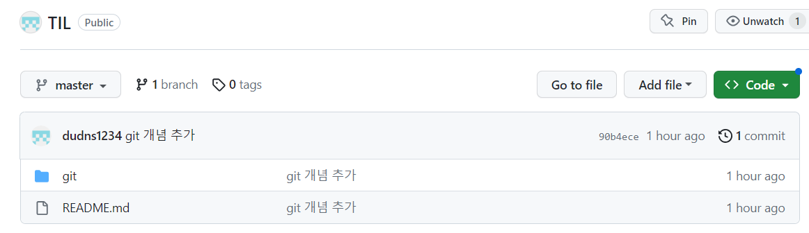
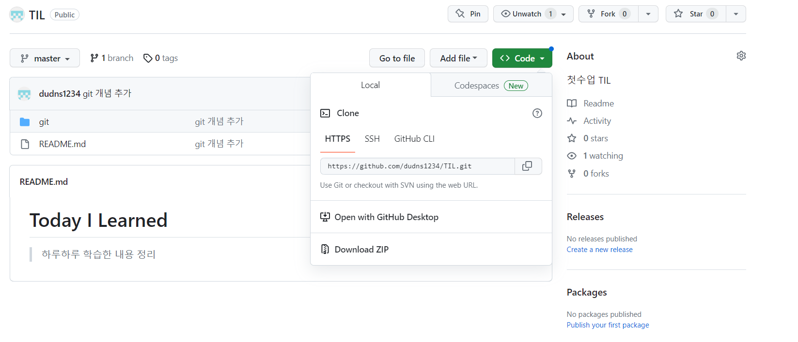
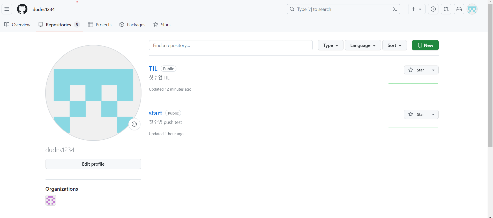
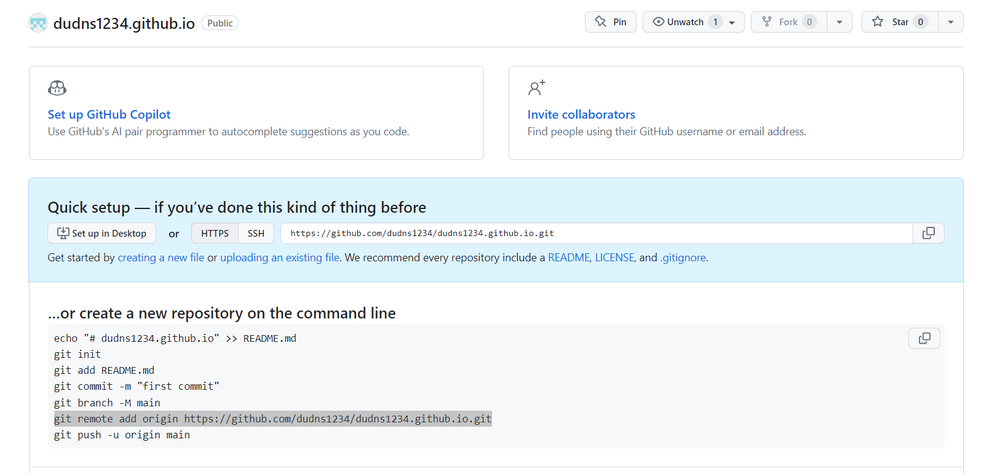
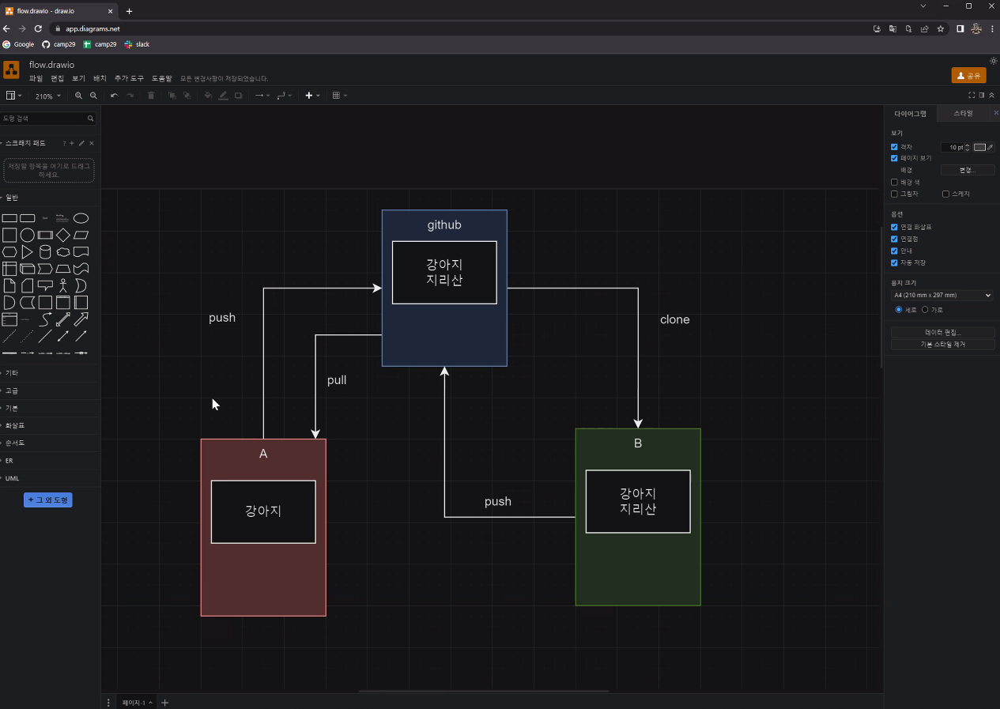
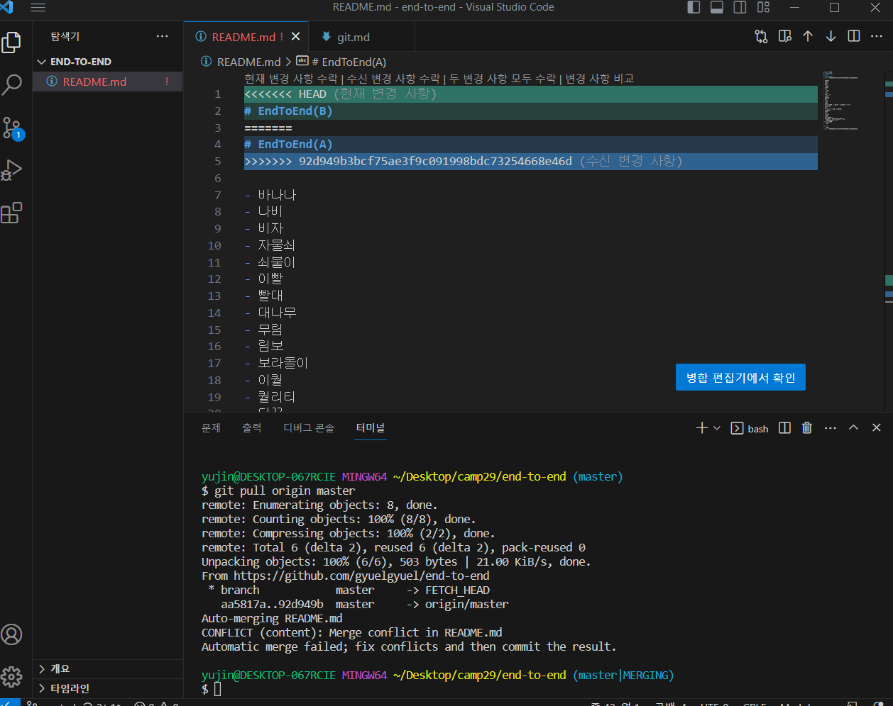
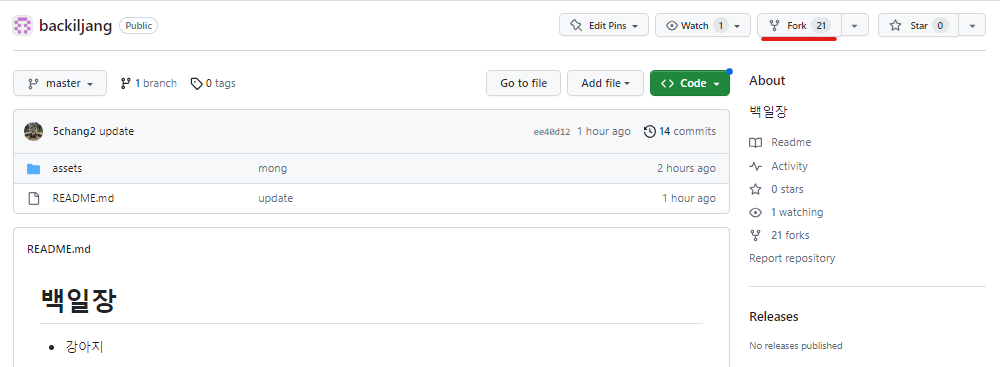

# git

## 버전 관리란?
“버전 관리” 는 무엇이고 우리는 왜 이것을 알아야 할까? 버전 관리 시스템은 파일 변화를 시간에 따라 기록했다가 나중에 특정 시점의 버전을 다시 꺼내올 수 있는 시스템이다. 이 책에서는 버전 관리하는 예제로 소프트웨어 소스 코드만 보여주지만, 실제로 거의 모든 컴퓨터 파일의 버전을 관리할 수 있다.

## 분산 버전 관리 시스템 (DVCS)


## 세가지 상태


## 명령어

```shell
git init
```
- `.git directory`를 생성하는 명령어

```shell
git add .
```
- `working directory`에 있는 파일, 폴더를 `staging area`에 추가
- add 하기전엔 파일이 저장이 되었는지 확인하기

```shell
git commit -m 'message
```
- `staging area`에 올라간 파일들을 저장

```shell
git remote add origin <remote url>
```
- 원격저장소 주소를 origin이라는 별명으로 저장

```shell
git push origin master
```
- `master` 브랜치를 `origin` 원격저장소로 업로드

```shell
git clone <remote url>

```
- 원격 저장소에 있는 레포를 현재 폴더에 복제

```shell
git pull origin master

```
- 원격 저장소에 마지막 코드 상태를 다운로드


## git 까지의 세세한 과정
1. 바탕화면에 폴더 생성 C:\Users\yujin\Desktop\camp29\TIL
2. TIL 폴더에 들어가서 마우스 오른쪽 -> Code로 열기 진행
3. git init

    - 현재 폴더에 `.git` 폴더를 생성
    - .git directory를 만든 것
    - **최초로 한 번 설정**
4. git add .
    - 'Working Diectory' 에서 'Staging Area'로 파일을 업로드
    - `git status` 로 현재 상태를 체크    
    - 주의할 점 : add 뒤에 띄어쓰기한 후에 .

5. git commit -m "git 개념 추가"
    - 'staging area'에 올라간 파일들의 스냅샷을 찍어 '.git directory'에 저장
    - 일반적으로 '-m' 옵션을 넣어서 커밋메세지를 추가하여 등록
    -

6. git remote add origin https://github.com/dudns1234/TIL.git
    - remote : 원격 저장소를 관리하는 명령어 
    - 주소는 나의 github에 새로운 repository를 만든다.
    - 
    - 
    - 
    - **최초로 한 번 설정**

7. git push origin master
    - origin : 업로드할 github 주소의 별명
    - master : 여러가지의 branch 모음집..?

8. 내용 수정 후에는 ctrl + S 해준후에 2,3,5번 작업 진행해주면 됨.

---


# 230725 2번째 수업
## 오전수업
### Site 만들기
1. 템플릿으로 개인 site 만들기 [start Bootstrap](https://startbootstrap.com/theme/personal)
2. camp29에 다운로드 받은 템플릿 압축해제후 그 폴더에서 code로 열기
3. git init -> git add . -> git commit -m "message" -> (repository 생성) -> git remote add origin <remote url> -> git push origin master

    3-1. repository name : githubID.github.io (규칙을 지켜야 도메인 호스팅을 해줌)   
    3-2. 확장프로그램 : open in browser 설치   
    3-3. html 문서에 마우스 오른쪽 Open In default Browser로 Site 열어줌
4. 개인 Site 수정   
    4-1. 3-3에서 연 Site를 중심으로 변경하고 싶은 부분 ctrl+f 로 search해서 값 변경   
    4-2. 값 변경한 후에 ctrl+S해준 후 열어놓은 site 새로고침하여 확인

### github로 협업하기
1. A 작업자 : repository 생성후 값 기입한 후 add, commit, push -> repository 협업자에게 공유
   B 작업자 : A가 공유한 repository 확인

2. B 작업 진행
    - git bash : camp29 폴더로 가서 git bash로 열기
    - 링크 복사 : A가 공유한 repository로 가서 code HTTPS 링크 복사
    - git clone <HTTPS url> : A 작업물 복제
    - 폴더 확인 : camp29 폴더에 A repository 폴더가 생긴걸 확인
    - VScode열기 : 해당 폴더 VScode로 열기 진행
    - 내용수정
    - git add. -> git commit -m "update" -> git push origin master
    - Tips : B는 init과 remote는 이미 A가 다 진행했기 때문에 B는 안함.

3. A 작업 진행
    - git **pull** origin master : B가 수정한 내용 A에도 반영
    - 내용수정
    - git add. -> git commit -m "update2" -> git **push** origin master

4. B 작업 진행
    - git **pull** origin master : A가 수정한 내용 B에도 반영
    - 내용수정
    - git add. -> git commit -m "update2" -> git **push** origin master



## 오후수업

1. 충돌 테스트

- if 충돌이 발생한 경우 (=pull을 진행하지 않고 push한 경우)
    -VScode 선택하여 해결
        - 3가지 방법 중에서 한 가지 선택
        
        - git add . -> git commit -m "message" -> git push origin master
        - 과정
            - git add .   
            - git push origin master (충돌)    
            - git pull origin master   
            - 3가지 선택   
            - git add .   
            - git commit -m "update"   
            - git push origin master
    - Github에서 지워서 해결
        - 백일장을 여러명이 fork 진행하여 내용을 수정하여 push하였고 마음에 드는걸 2개 선택 후 원하는 부분만 지운후에 병합까지 진행

2. branch
- git branch -c jyj (c:create) : branch 생성
- git branch : branch 생성 확인
- git switch jyj : branch master에서 jyj로 이동(수정본)
- git switch master : branch jyj에서 master로 이동(원본)
> 대부분 master branch에서 수정하지 않고 수정본인 jyj branch에서 수정함.

#### jyj branch 수정 예시   
- git add.   
- git commit -m "jyj"   
- git push origin **jyj**
- github에서 master과 병합 진행
- git switch master
- git pull origin **master**


3. folk
- camp29에서 만든 repository(백일장)을 folk 진행.
- Owner은 내계정으로 바꿔주고 repository name도 그대로 유지
- create fork 진행

- fork를 제대로 해왔는지 확인 후 code에서 https 복사
- camp29 폴더에서 git bash 으로 열기
- git clone <https url> 진행
- camp29 폴더에 백일장 폴더 만들어진 것 확인 후 해당 폴더 code로 열기
- git add . -> git commit -m "수정" -> git push origin master